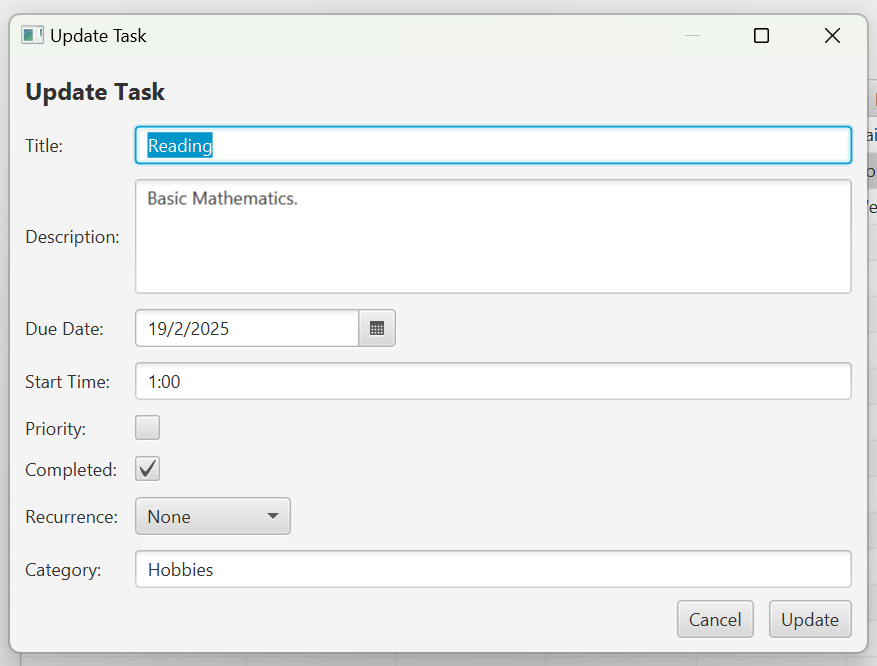

# ToDo_Scheduler
ToDo Scheduler is a JavaFX desktop application for managing tasks. It lets you register, log in, create, update, delete, and filter tasks. Tasks can be one‑time or recurring (daily, weekly, fortnightly, or monthly). The application stores data in an SQLite database.

## Features

* **Task Management**
Create new tasks with title, description, due date, start time, priority, completion status, recurrence, and category. 

* **Filtering and Calendar View**
Filter tasks using radio buttons (e.g. All, Overdue, Completed, Priority).
A built‑in calendar view allows you to pick a date, automatically updating the task list to show tasks due on that day.

* **Registration**
Users register with a username and a password. The password must be at least 6 characters long and include letters, numbers, and special characters. The application checks if the username already exists before creating an account.

* **Login**
Users log in with their credentials. Passwords are securely hashed using BCrypt.

* **Task Recurrence**
When a recurring task is marked as completed, the application automatically calculates the next due date based on the recurrence pattern (daily, weekly, fortnightly, or monthly). Special handling ensures that monthly recurrences account for months with fewer days.

* **Packaging and Launching** The application can be built with Maven, packaged as an executable jar, and further wrapped into a native installer using jpackage or alternatives like Launch4J.

## Requirements

* **Java JDK 14 or later** (for jpackage support if packaging an installer).
* **Maven** for building the project.
* **SQLite** is used as the database.
* **WiX Toolset** (optional) if you plan to create a native Windows installer using jpackage.
* **Git** for version control.